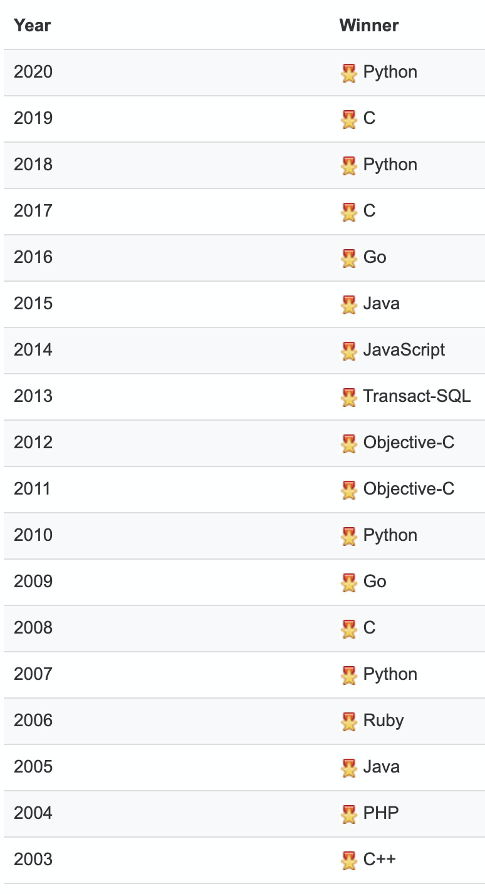
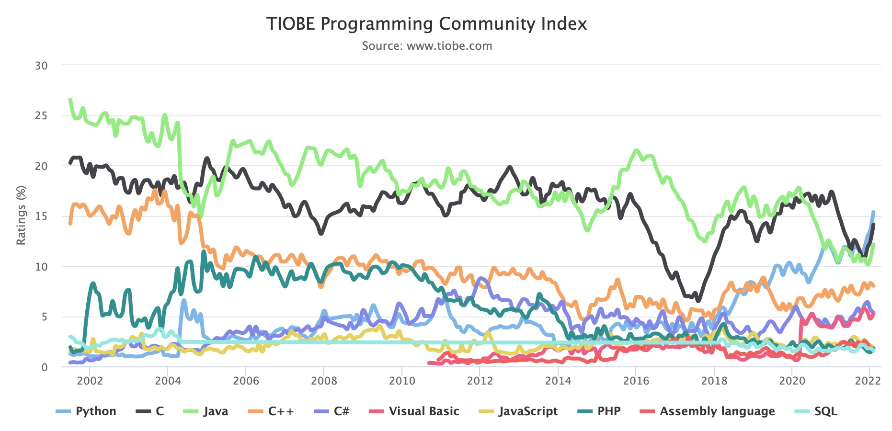

**Python** (英国发音：[/ˈpaɪθən/](https://zh.wikipedia.org/wiki/Wikipedia:%E5%9C%8B%E9%9A%9B%E9%9F%B3%E6%A8%99%E8%8B%B1%E8%AA%9E%E7%99%BC%E9%9F%B3 "Wikipedia:国际音标英语发音") 美国发音：[/ˈpaɪθɑːn/](https://zh.wikipedia.org/wiki/Wikipedia:%E5%9C%8B%E9%9A%9B%E9%9F%B3%E6%A8%99%E8%8B%B1%E8%AA%9E%E7%99%BC%E9%9F%B3 "Wikipedia:国际音标英语发音") )，想必大家都已经听说。在人工智能、大数据领域都有着广泛的运用。`Life is short, we use Python`， 学它就是啦。官方概述请参阅[此处](https://wiki.python.org/moin/%E5%88%9D%E5%AD%A6%E8%80%85%E5%85%A5%E9%97%A8/%E6%A6%82%E8%BF%B0)。  

关于Python，不得不提Python之父 --- **吉多·范罗苏姆**（Guido van Rossum）。人称**龟叔**，Python程序设计语言的最初设计者及主要架构师。在Python社区，吉多·范罗苏姆被人们认为是**终身仁慈独裁者**（BDFL），意思是他仍然关注Python的开发进程，并在必要的时刻做出决定[^1]。

图 1-1 龟叔 吉多·范罗苏姆

> **Guido van Rossum** is the creator of the Python programming language. He grew up in the Netherlands and studied at the University of Amsterdam, where he graduated with a Master's Degree in Mathematics and Computer Science. His first job after college was as a programmer at CWI, where he worked on the ABC language, the Amoeba distributed operating system, and a variety of multimedia projects. During this time he created Python as side project. He then moved to the United States to take a job at a non-profit research lab in Virginia, married a Texan, worked for several other startups, and moved to California. In 2005 he joined Google, where he obtained the rank of Senior Staff Engineer, and in 2013 he started working for Dropbox as a Principal Engineer. In October 2019 he retired. Until 2018 he was Python's **BDFL** (Benevolent Dictator For Life), and he is still deeply involved in the Python community. Guido, his wife and their teenager live in Silicon Valley, where they love hiking, biking and birding [^2].

更详细的信息，可以参阅`龟叔`的个人[博客主页](https://gvanrossum.github.io/)。

### 命名由来

> 关于Python的起源，吉多·范罗苏姆在1996年写到：
> 
> > 六年前，在1989年12月，我在寻找一门“课余”编程项目来打发圣诞节前后的时间。我的办公室会关门，但我有一台家用电脑，而且没有太多其它东西。我决定为当时我正构思的一个新的脚本语言写一个解释器，它是ABC语言的后代，对UNIX / C程序员会有吸引力。作为一个略微有些无关想法的人，和一个`蒙提·派森的飞行马戏团`的狂热爱好者，我选择了Python作为项目的标题[^1]。

简单来讲，**龟叔**于1989年圣诞节期间，为了打发**无聊时间**而写的一个解释器，因喜爱电视剧**Monty Python’s Flying Circus**，故将此解释器命名为**Python**。

### Python2 & Python3

目前Python有两个主要版本：`Python 2`和`Python 3`。官方已与2020年一月停止`Python2`维护，官方强烈推荐使用`Python3`。

> Python 3 is strongly recommended for any new development. As of January 2020, [Python 2 has reached End Of Life status](https://www.python.org/dev/peps/pep-0373/), meaning it will receive no further updates or bugfixes, including for security issues. Many frameworks and other add on projects are following a similar policy. As such, we can only recommend learning and teaching Python 3[^3].

### Logo

Python的Logo是两条环绕的蛇，如图1-2所示：

图 1-2 Python Logo

### 历史

1. **在1991年2月，范罗苏姆发布了最初代码（标记为版本0.9.0）**
   
   **主要特征**：带继承的类、异常处理、函数和核心数据类型list、dict、str等。

2. **Python1.0于1994年1月发布**
   
   **主要特征**：提供的函数式编程工具`lambda`、`map`、`filter`和`reduce`。

3. **Python 2.0于2000年10月16日发布**
   
   **主要特征**：引入*列表推导式*，增加*垃圾回收机制*，并且支持*Unicode*。

4. **Python 3.0于2008年12月3日发布**，该版本与*Python2*差异较大，不能向后兼容。

5. **2020年一月，Python2停止维护**，`Python 3.9`、`3.10`和后续版本正在被完全支持，提供对`3.7`和`3.8`版本的安全性修复。

### 排名

[TIOBE编程语言排行榜](https://www.tiobe.com/tiobe-index/)每月公布上一月的开发语言排名，每年年初公布上一年度的年度语言，截止2021年12月底，年度语言排行和各语言走势如图1-3、图1-4所示：

图1-3 编程语言年度语言（<strong>Programming Language Hall of Fame</strong>）

图1-4 编程语言长期走势图

## 参考文献

[^1]: https://zh.wikipedia.org/wiki/%E5%90%89%E5%A4%9A%C2%B7%E8%8C%83%E7%BD%97%E8%8B%8F%E5%A7%86

[^2]: https://gvanrossum.github.io/bio.html

[^3]: https://wiki.python.org/moin/Python2orPython3
