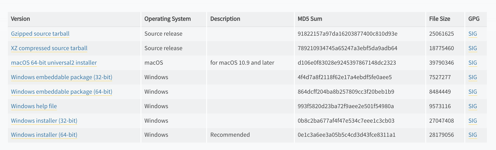

使用Python之前，需要先安装Python。因为 Python 是跨平台的，它可以运行在 Windows、Mac 和各种 Linux/Unix 系统上。

### Windows系统

在windows系统上安装Python的方式有多种，比如`anaconda` 、`chocolatey` 等。对于初学者，**墙裂建议**使用发行版安装包 (**msi**格式) 的方式安装。

**安装步骤**：

1. 从[官网](https://www.python.org/downloads/release/python-3101/)下载发行版安装包，本文选择的是`3.10.1`版本，目前绝大多数的计算机是64位：
   
   
   
   > **注意**:
   > 
   > Python 3.10 支持 Windows 8.1 及其后的版本， Windows 7 请安装 Python 3.8。

2. 双击启动安装程序，勾选`Install launcher for all users (recommended)`和`Add Python 3.x to PATH` 复选框。可以选择以下两个选项之一：
   
   - `Install Now`， 默认安装
   
   - `Costomize Installation`，自定义安装，可以选择安装路径

> **注意**:
> 
> **选择安装路径时注意**：
> 
> 1. 路径名不要包含中文、特殊符号、短线，尽量不要包含空格，可以使用下划线；
> 
> 2. 路径长度不超过260个字符；


3. `步骤2`中，其他安装页可以默认，直接点击`Next`，安装完毕以后关闭即可。

### Mac系统

Mac系统安装Python，可使用[HomeBrew](https://brew.sh/#install)，详细安装步骤请参阅[此处](https://docs.python-guide.org/starting/install3/osx/)。

### Linux系统

部分Linux版本已预装`Python3`，详细安装步骤请参阅[此处](https://docs.python-guide.org/starting/install3/linux/)。

### 开发环境

在[安装](##安装)章节里，我们学会了在电脑上安装Python环境，那有了Python环境以后，怎么编写或者怎么运行Python代码呢？

#### CPython

当我们从[Python官方网站](https://www.python.org/)下载并安装好Python 3.x后，我们就直接获得了一个官方版本的解释器：**CPython**。这个解释器是用C语言开发的，所以叫**CPython**。在命令行（快捷键：`win+R`，输入`cmd`，然后回车）下运行`python`就是启动CPython解释器：

```python
python3
Python 3.8.0 (v3.8.0:fa919fdf25, Oct 14 2019, 10:23:27) 
[Clang 6.0 (clang-600.0.57)] on darwin
Type "help", "copyright", "credits" or "license" for more information.
>>> 
```

CPython用`>>>`作为提示符，比如，我们在该交互式环境下，输入`print('hello, world')`，然后回车，可以看到执行的结果：

```python
>>> print('hello, world')
hello, world
>>> 
```

> `print()`函数的意思是打印输出，具体的使用可参阅[常用函数](###%E5%B8%B8%E7%94%A8%E5%87%BD%E6%95%B0)。

**CPython**详细的使用，请参阅[Python 解释器](https://docs.python.org/zh-cn/3/tutorial/interpreter.html)和[命令行与环境](https://docs.python.org/zh-cn/3/using/cmdline.html)。

> **彩蛋1**：Zen of Python -- Python 之禅
> 
> > 交互模式提示符中输入 `import this`，列出 Python 设计的原则与哲学，有助于理解与使用这种语言。
> 
> ---
> 
> **彩蛋2**： turtledemo -- `turtle`海龟绘图示例
> 
> > 可以在命令行中运行`python -m turtledemo`，然后在打开的窗口中选择`Examples`彩蛋执行脚本(有兴趣的读者请自行研究)。详细的海龟绘图教程请参阅[海龟绘图文档](https://docs.python.org/zh-cn/3/library/turtle.html)。

#### IDLE

**IDLE**是安装Python环境时自带的集成开发工具。但是由于**IDLE**的用户体验并不是那么好，所以很*少在实际开发中被采用*。**IDLE**详细的使用教程可以参阅官方的[IDLE文档](https://docs.python.org/zh-cn/3/library/idle.html)。  

#### PyCharm

尽管Python提供了CPython解释器和IDLE，能够满足我们编写代码或者运行代码需求，但体验太差、开发效率太低，所以在实际开发过程中，更多的是使用第三方的代码编辑器，如*Eclipse*、*Vs Code*、*Spyder*等。本文**推荐**使用[PyCharm 教育版](https://www.jetbrains.com/edu-products/download/#section=pycharm-edu)(**PyCharm Edu**):

- PyCharm教育版开源免费，包括了PyCharm社区版(PyCharm Community)的功能；

- PyCharm教育版是[**jetbrains**](https://www.jetbrains.com/)开发，使用与*IntelliJ IDEA*、*webstorm*等生态产品几乎一致；

PyCharm教育版下载链接：[Get Your Educational Tool - JetBrains](https://www.jetbrains.com/edu-products/download/#section=pycharm-edu)

PyCharm的安装步骤请参阅 [玩转PyCharm](https://github.com/jackfrued/Python-100-Days/blob/master/%E7%95%AA%E5%A4%96%E7%AF%87/%E7%8E%A9%E8%BD%ACPyCharm.md)和下文的[IntelliJ IDEA教程](https://github.com/judasn/IntelliJ-IDEA-Tutorial)。  

**PyCharm使用**:

1. 安装完PyCharm以后，打开，如下图所示：


2. 点击`Ceate New Project`按钮，新建工程：
   
   
   
   输入**路径**和**项目名称**，选择`Existing interpreter`，使用本机的解释器。

3. 在打开的项目主界面中，右击工程名称，选择`New` —> `Python File`，创建Python文件：
   
   

4. 在弹出的输入框中输入文件名称，比如：`hello_python`，回车，然后在编辑框中输入简单的代码，比如：`print('hello, Python')`：
   
   

5. 右击编辑区，选择`Run 'hello_python'`便可运行代码:
   
   
   
   运行结果会显示在PyCharm下方，如下去：
   
   
   
   到此，PyCharm的安装和基本使用已讲解完毕，PyCharm详细的使用请参阅[官方指导](https://www.jetbrains.com/help/pycharm/quick-start-guide.html)或者[IntelliJ IDEA教程](https://github.com/judasn/IntelliJ-IDEA-Tutorial)。 
