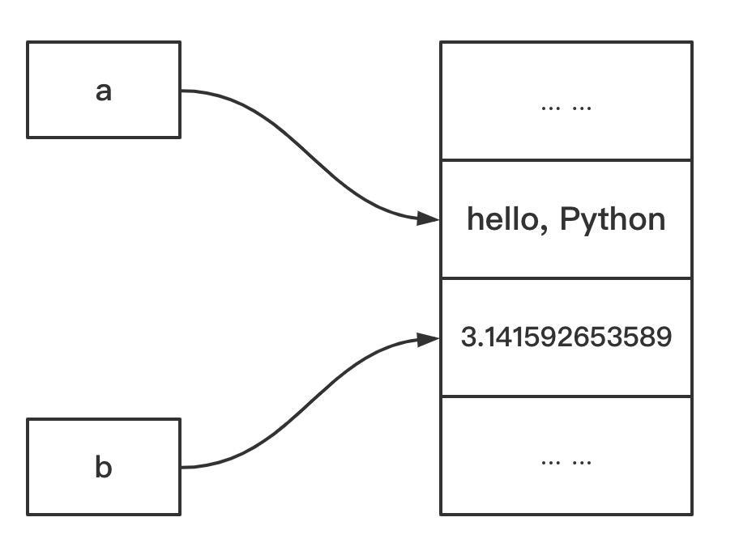
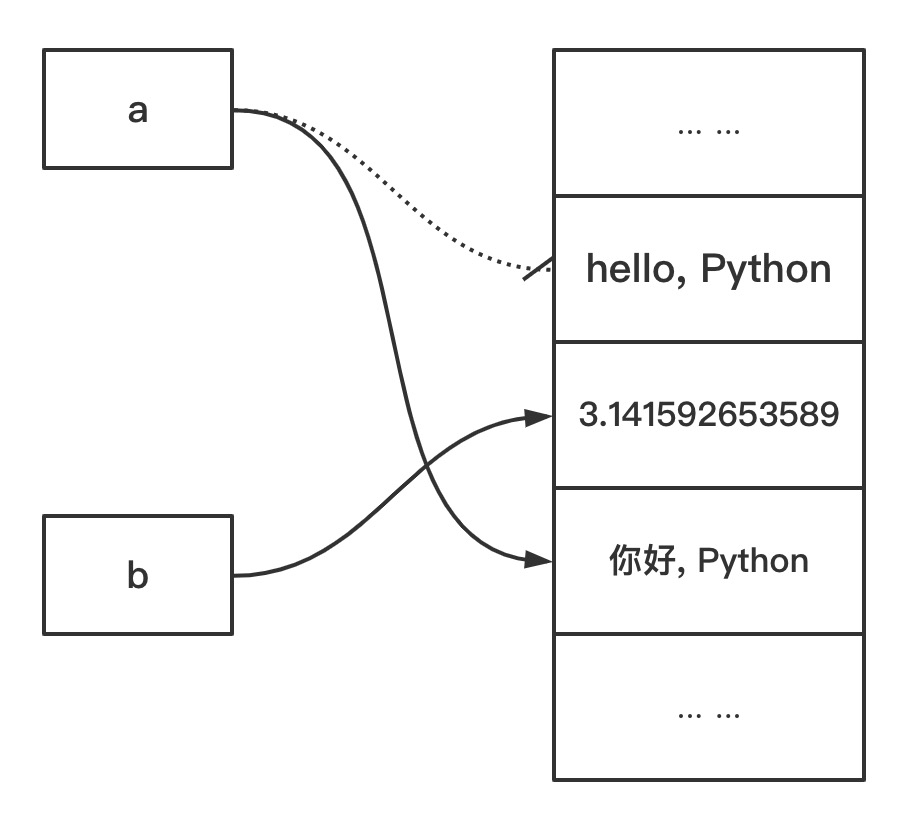

在前面的学习当中，我们能在执行`print('hello, world')`这行代码，但是如果要编写更复杂的代码，我们就要学习Python的**基础知识**。本节的内容主要是Python基础知识，具体包括：

1. **变量**

2. **注释**

3. **基本数据类型**

4. **数据类型之间的转换**

5. **常用函数**

6. **语法要点**

### 变量

在讲解`变量`之前，我们再来看看`print('hello, Python')`这行代码，非常简单的一行代码———打印`hello,world`这个字符，假设现在的要求打印`hello, Python`**100**行，代码如下：

```python
print('hello, Python')
print('hello, Python')
print('hello, Python')
print('hello, Python')
print('hello, Python')
# ...省略很多行 
print('hello, Python')
print('hello, Python')
print('hello, Python')
print('hello, Python')
print('hello, Python')
```

再来一个极端的假设：现在需求改动，需要将打印的内容改为`你好，Python`，一个简单的需求改动，需要将**100**行代码的`hello, Python`都改为`你好，Python`？显然不是。更好的方法是用**变量**来解决这个问题。  

所谓的**变量**，就是计算机内存的指向，一个真实数据的代理，就像一个班级里面，每个人的名字代表一个具体的同学一样。比如：`a`指向`hello, Python`这个值，`b`指向`3.141592653589`这个值，变量可以声明任意类型的数据。变量在存储空间的指向示意图如下所示：



在以上的示意图中，`a`和`b`就是变量的名字，通俗的说法就是**变量**，在Python里，可以使用`=`将一个值赋值给一个变量，比如：

```python
a = 'hello, Python'
b = 3.141592653589
```

有了变量以后，`print('hello, Python')`就可以改为：

```python
a = 'hello, Python'
print(a)
```

如果需要打印`你好，Python`，只需将变量`a`的值修改一下：

```python
a = 'hello, Python'
print(a)
a = '你好, Python'
print(a)
```

这样就不用将**100**行代码的`hello, Python`都改为`你好，Python`啦。修改以后，变量`a`在存储空间的示意图如下：



变量`a`指向的值从`hello, Python`变为`你好, Python`。  

#### 变量的命名规范

在Python中，`a`是合法的变量，`b`也是合法的变量，变量的命名遵循以下**规范**：

1. 大小写字母 `A` 至 `Z`、下划线 `_` 、数字 `0` 至 `9`，但不能以数字开头，多个单词以下划线连接；

2. 不能是**关键字**（有特殊含义的单词，后面会讲到），不能和系统保留字（如函数、模块等的名字）冲突；

3. 变量名最好能”见名思意“，变量的大小写是敏感的，如 `myname` 和 `myName` 不等同；

**示例**：

```python
变量 = 'hello' # 允许但不规范，严格不推荐
98k = 'hello' # 非法，不能以数字开头
k98 = 'hello' # 合法
hello world = 'hello' # 非法，只能是英文字符、数组、或者下划线
hello-world = 'hello' # 非法，只能是英文字符、数组、或者下划线
hello_world = 'hello' # 合法
```

> **注意:**
> 
> [PEP 8规范中](https://www.python.org/dev/peps/pep-0008/)，变量用小写字母拼写。
> 
> 以下标识符为**保留字**，或称 **关键字**，不可用于普通变量名。关键字的拼写必须与这里列出的完全一致：
> 
> ```python
> False      await      else       import     pass
> None       break      except     in         raise
> True       class      finally    is         return
> and        continue   for        lambda     try
> as         def        from       nonlocal   while
> assert     del        global     not        with
> async      elif       if         or         yield
> ```

### 注释

**注释**是对代码的解释说明或者使代码不执行，在代码运行的过程中不会执行。Python中使用 `#` 来注释，`#` 后面的内容都不会执行，规范的写法 `#` 需要添加一个空格。 

```python
# 注释：print函数打印内容
print('hello, Python')
# print('你好, Python') # 注释代码，使代码不执行
```

> 规范的注释在实际项目开发中非常有必要，它会让代码开发者和代码维护者快速的明白代码的意思。正所谓**代码会告诉你怎么做，注释会告诉你为何如此**。

### 基本数据类型

前面的示例中，我们 `‘hello, Python’` 和 `3.141592653589`两个值，这两个值有一个带有引号，另外一个没有，这是因为他们的数据类型不同。计算机需要处理很多种数据，比如：整数、小数、文本等。  

编程语言引入不同数据类型的原因有一下两个：

1. **不同数据类型的数据，其操作方法不同**。比如，数组可以做加、减、乘、除等操作，而文本数据就只能做拼接、索引等操作；

2. **不同的数据类型在内存中所占用的大小不一样**（在Python中体现不明显）。计算机内存是非常珍贵的资源，为了合理高效的利用系统内存，Python会为不用的数据类型分配不同的内存大小，比如：一个整数分配的内存相对小一点，而一个小数分配的内存相对要多一点。

Python语言的基本数据类型有**数值**、**字符串**等。  

#### 数值

数值型数据用来表示数据的大小，数值有**整型**(`int`)、**浮点数**(`float`)和**复数**(`complex`)。

##### 整型

**整型**能够表示任意大小的数字（只要内存允许），也就是说，整型可以表示无限大小的数字。表示方法和数学上的写法一模一样，例如：`1`，`100`，`-8080`，`0`，等等。  

Python允许在数值之间添加下划线（`_`），下划线只是为了分组数字，让数字更易读，确定数值时，会忽略字面值中的下划线。例如`10000000000`，很难数清楚0的个数，可以写成`10_000_000_000`。    

> **布尔值**属于整数的子类型，但其和常规的整型不太一样，所以单独放在下文[布尔值](####布尔值)章节。

###### 进制

常规的数字是**十进制**表示，Python支持**二进制**、**八进制**、**十六进制**。

**二进制**（**bindigit**）

*二进制* 是以`0b`或者`0B`作为前缀，字面值只能是`0`或者`1`:

```python
>>> print(0b10)
2
>>> print(0b1001)
9
>>> 0B100
4
>>> 0B100_100_100
292
```

**八进制**（**octdigit**）

*八进制* 是以 `0o`或者`0O`作为前缀，字面值只能是`0 ~ 7`:

```python
>>> 0o10
8
>>> 0o101
65
>>> 0O100_100
32832
```

**十六进制**（**hexdigit**）

*十六进制* 是以`0x`或者`0X`作为前缀，字面值只能是`0 ~ 9` 或者 `a ~ f` 或者`A ~ F` :

```python
>>> 0x1f
31
>>> 0XFF
255
>>> 0XFF_EE
65518
```

##### 浮点型

**浮点型**就是小数，表示机器级的双精度浮点数。浮点数可以是普通的小数，也可以是科学计数法。如：`3.23` 或`52.3E-4` 。其中， `E` 表示 `10` 的幂。在这里，`52.3E-4` 表示 `52.3 * 10^-4`。浮点数字面值示例如下：

```python
3.14    10.    .001    1e100    3.14e-10    0e0    3.14_15_93
```

计算机对浮点数的表达本身是不精确的。保存在计算机中的是二进制数，二进制对有些数字不能准确表达，只能非常接近这个数。

> Python 不支持单精度浮点数，理由是节省处理器和内存消耗，但这点节省相对于在 Python 中使用对象的开销来说太过微不足道，因此没有理由包含两种浮点数而令该语言变得复杂。
> 
> **扩展阅读**：
> 
> [浮点算术：争议和限制](https://docs.python.org/zh-cn/3/tutorial/floatingpoint.html#tut-fp-issues)

##### 布尔值

布尔值表示逻辑上的真假，要么是 `True`，要么是 `False`：

```python
>>> 1 > 0
True
>>> 1 < 0
False
```

##### 复数

Python 还内置支持 [复数](https://docs.python.org/zh-cn/3/library/stdtypes.html#typesnumeric)，后缀 `j` 或 `J` 用于表示虚数（例如 `3+5j` ）。复数在实际中使用较少，不作过多赘述。

##### 数值运算

数值在实际运用当中使用非常普遍，支持的数据操作也很多，主要包括：**算术运算**、**比较运算**、**逻辑运算**、**按位运算**。

###### 算术运算

数字类型（复数除外）支持的运算：

| 运算符  | 运算       | 结果            | 备注                                                                                               |
|:----:|:--------:|:-------------:|:------------------------------------------------------------------------------------------------:|
| `+`  | `x + y`  | *x* 和 *y* 的和  | 求和                                                                                               |
| `-`  | `x - y`  | *x* 和 *y* 的差  | 求差                                                                                               |
| `*`  | `x * y`  | *x* 和 *y* 的乘积 | 求积                                                                                               |
| `/`  | `x / y`  | *x* 和 *y* 的商  | 求商                                                                                               |
| `//` | `x // y` | *x* 和 *y* 的商数 | 也称为整数除法。 运算结果总是向负无穷的方向舍入: `1//2` 为 `0`，` (-1)//2` 为 `-1`, `1//(-2)` 为`-1` ，而 `(-1)//(-2)` 为 `0`。 |
| `%`  | `x % y`  | `x / y` 的余数   | 取余                                                                                               |
| `**` | `x ** y` | `x`的`y`次方     | 乘方                                                                                               |

**示例**:

```python
>>> # 算术运算
>>> # 求和
>>> 1234 + 2345
3579
>>> # 求差
>>> 4356 - 2334
2022
>>> # 求积
>>> 234 * 432
101088
>>> # 求商
>>> 10 / 3
3.3333333333333335
>>> # 整除
>>> 10 // 3
3
>>> # 取余
>>> 10 % 3
1
>>> # 乘方
>>> 2 ** 3
8
```

数字类型支持的方法操作：

| 方法       | 函数             | 结果                | 备注                                                                            |
|:--------:|:--------------:|:-----------------:|:-----------------------------------------------------------------------------:|
| `abs`    | `abs(x)`       | *x* 的绝对值或大小       | 返回一个数的绝对值。 参数可以是整数、浮点数。 如果参数是一个复数，则返回它的模。                                     |
| `int`    | `int(x)`       | 将 *x* 转换为整数       | 详细内容参阅[`int()`](https://docs.python.org/zh-cn/3/library/functions.html#int)方法 |
| `float`  | `float(x)`     | 将 *x* 转换为浮点数      |                                                                               |
| `divmod` | `divmod(x, y)` | `(x // y, x % y)` | 返回一个元组，第一个数值是整除，第二个数值是取余                                                      |
| `pow`    | `pow(x, y)`    | *x* 的 *y* 次幂      | `pow(0, 0)` 和 `0 ** 0` 定义为 `1`                                                |

**示例**：

```python
>>> # 数字类型支持的方法操作
>>> # 绝对值
>>> abs(-10)
10
>>> # int()方法操作
>>> int('10')
10
>>> int(0xff)
255
>>> int(0b10)
2
>>> int('0xff', base=16)
255
>>> # float()方法操作
>>> float(1)
1.0
>>> float('1e-003')
0.001
>>> float('+1E6')
1000000.0
>>> # divmod()方法操作
>>> divmod(10, 3)
(3, 1)
>>> # pow()方法操作
>>> pow(2, 3)
8
```

###### 赋值运算

###### 比较运算

在 Python 中有八种比较运算符。比较运算的结果是布尔值。比较运算可以任意串连；例如，`x < y <= z` 等价于 `x < y and y <= z`，前者的不同之处在于 *y* 只被求值一次（但在两种情况下当 `x < y` 结果为假值时 *z* 都不会被求值）。比较运算符如下表所示：

| 运算       | 含意      |
|:--------:|:-------:|
| `<`      | 严格小于    |
| `<=`     | 小于或等于   |
| `>`      | 严格大于    |
| `>=`     | 大于或等于   |
| `==`     | 等于      |
| `!=`     | 不等于     |
| `is`     | 对象标识    |
| `is not` | 否定的对象标识 |

除不同的数字类型外，不同类型的对象不能进行相等比较。`==` 运算符总有定义，但对于某些对象类型（例如，类对象），它等于 [`is`](https://docs.python.org/zh-cn/3/reference/expressions.html#is) 。其他 `<`、`<=`、`>` 和 `>=` 运算符仅在有意义的地方定义。例如，当参与比较的参数之一为复数时，它们会抛出 [`TypeError`](https://docs.python.org/zh-cn/3/library/exceptions.html#TypeError "TypeError") 异常。

**示例**：

```python
>>> 1 > 0
True
>>> 0b10 == 2
True
>>> 0o10 != 8
False
>>> 0xff >= 255
True
>>> 0b10 is int
False
>>> 0b10 is 2
True
>>> 
```

> 运算符 [`is`](https://docs.python.org/zh-cn/3/reference/expressions.html#is) 和 [`is not`](https://docs.python.org/zh-cn/3/reference/expressions.html#is-not) 用于检测对象的标识号：当且仅当 *x* 和 *y* 是同一对象时 `x is y` 为真。 一个对象的标识号可使用 [`id()`](https://docs.python.org/zh-cn/3/library/functions.html#id "id") 函数来确定。 `x is not y` 会产生相反的逻辑值。

###### 逻辑运算

Python规定，以下情况为**假** (**False**) :

- **被定义为假值的常量: `None` 和 `False`**；

- **任何数值类型的零: `0`, `0.0`, `0j`, `Decimal(0)`, `Fraction(0, 1)`**；

- **空的序列和多项集: `''`, `()`, `[]`, `{}`, `set()`, `range(0)`**；

- **一个对象在默认情况下均被视为真值**，除非当该对象被调用时其所属类定义了 `__bool__()` 方法且返回 `False` 或是定义了 `__len__()` 方法且返回零；

**逻辑运算**包括`and`, `or`, `not`三个运算符：

| 运算        | 结果                                             | 备注                                                                             |
|:---------:|:----------------------------------------------:|:------------------------------------------------------------------------------:|
| `x or y`  | **if *x* is false, then *y*, else *x***        | 短路运算符，只有在第一个参数为假值时才会对第二个参数求值                                                   |
| `x and y` | **if *x* is false, then *x*, else *y***        | 短路运算符，因此只有在第一个参数为真值时才会对第二个参数求值。                                                |
| `not x`   | **if *x* is false, then `True`, else `False`** | `not` 的优先级比非布尔运算符低，因此 `not a == b `会被解读为 `not (a == b)` 而 `a == not b` 会引发语法错误 |

> **重要**：
> 
> **布尔运算 `or` 和 `and` 总是返回其中一个操作数**。

**示例**：

```python
>>> 2 and 0
0
>>> 1 and 2
2
>>> 2 or 0
2
>>> 0 or 2
2
>>> not 0
True
>>> not 1
False
```

###### 按位运算

**按位运算**只对整数有意义。 计算按位运算的结果，就相当于使用无穷多个二进制符号位对二的补码执行操作。

按位运算列表:

| 运算       | 结果                | 备注                                                               |
|:--------:|:-----------------:|:----------------------------------------------------------------:|
| `x \| y` | *x* 和 *y* 按位 *或*  | 相同的位上做逻辑或运算                                                      |
| `x ^ y`  | *x* 和 *y* 按位 *异或* | 相同的位上，不同则为`1`，相同则为`0`                                            |
| `x & y`  | *x* 和 *y* 按位 *与*  | 相同的位上做逻辑与运算                                                      |
| `x << n` | *x* 左移 *n* 位      | 1. 负的移位数是非法的，会导致引发 ValueError；2.左移 n 位等价于乘以 pow(2, n) 。          |
| `x >> n` | *x* 右移 *n* 位      | 1. 负的移位数是非法的，会导致引发 ValueError；2. 右移 n 位等价于除以 pow(2, n) ，作向下取整除法。 |
| `~x`     | x 逐位取反            | `0`变为`1`， `1`变为`0`                                               |

**示例**：

```python
>>> # 按位运算示例
>>> # bin()函数会返回一个整数的二进制表示
>>> bin(10)
'0b1010'
>>> bin(9)
'0b1001'
>>> 10 | 9
11
>>> bin(10 | 9)
'0b1011'
>>> # 按位异或
>>> bin(10 ^ 9)
'0b11'
>>> # 按位与
>>> bin(10 & 9)
'0b1000'
>>> # 左移
>>> bin(10 << 2)
'0b101000'
>>> # 右移
>>> bin(10 >> 2)
'0b10'
>>> # 取反
>>> bin(~10)
'-0b1011'
```

###### 运算优先级

**运算优先级**即是运算符执行的优先顺序。下表对 Python 中运算符的优先顺序进行了总结，从最高优先级（上）到最低优先级（下）。 相同单元格内的运算符具有相同优先级：

| 运算符                                                                                                                                                                                                                                                                                                                                          | 描述                         |
|:--------------------------------------------------------------------------------------------------------------------------------------------------------------------------------------------------------------------------------------------------------------------------------------------------------------------------------------------:|:--------------------------:|
| `(expressions...)`,`[expressions...]`, `{key: value...}`, `{expressions...}`                                                                                                                                                                                                                                                                 | 绑定或加圆括号的表达式，列表显示，字典显示，集合显示 |
| `x[index]`, `x[index:index]`, `x(arguments...)`, `x.attribute`                                                                                                                                                                                                                                                                               | 抽取，切片，调用，属性引用              |
| `**`                                                                                                                                                                                                                                                                                                                                         | 乘方                         |
| `+x`, `-x`, `~x`                                                                                                                                                                                                                                                                                                                             | 正，负，按位非 NOT                |
| `*`, `@`, `/`, `//`, `%`                                                                                                                                                                                                                                                                                                                     | 乘，矩阵乘，除，整除，取余              |
| `+`, `-`                                                                                                                                                                                                                                                                                                                                     | 加和减                        |
| `<<`, `>>`                                                                                                                                                                                                                                                                                                                                   | 移位                         |
| `&`                                                                                                                                                                                                                                                                                                                                          | 按位与 AND                    |
| `^`                                                                                                                                                                                                                                                                                                                                          | 按位异或 XOR                   |
| `\|`                                                                                                                                                                                                                                                                                                                                         | 按位或 OR                     |
| [`in`](https://docs.python.org/zh-cn/3/reference/expressions.html#in), [`not in`](https://docs.python.org/zh-cn/3/reference/expressions.html#not-in), [`is`](https://docs.python.org/zh-cn/3/reference/expressions.html#is), [`is not`](https://docs.python.org/zh-cn/3/reference/expressions.html#is-not), `<`, `<=`, `>`, `>=`, `!=`, `==` | 比较运算，包括成员检测和标识号检测          |
| [`not`](https://docs.python.org/zh-cn/3/reference/expressions.html#not) `x`                                                                                                                                                                                                                                                                  | 布尔逻辑非 NOT                  |
| [`and`](https://docs.python.org/zh-cn/3/reference/expressions.html#and)                                                                                                                                                                                                                                                                      | 布尔逻辑与 AND                  |
| [`or`](https://docs.python.org/zh-cn/3/reference/expressions.html#or)                                                                                                                                                                                                                                                                        | 布尔逻辑或 OR                   |

> **重要**：
> 
> **优先级更好的代码书写是使用括号**。

#### 字符串

**字符串**，即文本数据，是由若干字符拼在一起的序列。在 Python 中使用 [`str`](https://docs.python.org/zh-cn/3/library/stdtypes.html#str "str") 对象处理文本数据。字符串有多种申明的方式：

- 单引号: `'允许包含有 "双" 引号'`

- Double quotes: `"允许包含 '单' 引号"`

- 三重引号： 三个单引号或者三个双引号，比如：`'''三重单引号'''`、 `"""三重双引号"""`。使用三重引号的字符串可以跨越多行，其中所有的空白字符都将包含在该字符串字面值中。

```python
>>> # 定义字符串
>>> # 使用单引号
>>> a = 'hello, Python'
>>> # 使用双引号
>>> b = "hello, Python"
>>> # 使用三引号
>>> c = '''
hello, Python
hello, Python
'''
>>> d = """
hello, Python

hello, Python
"""
>>> a
'hello, Python'
>>> b
'hello, Python'
>>> c
'\nhello, Python\nhello, Python\n'
>>> d
'\nhello, Python\n\nhello, Python\n'
>>> 
```

Python使用单引号、双引号、三重引号来申明字符串，其实是为了简化代码编写。在实际的字符串中，时常会遇到字符串本身包含单引号或者双引号，如果只用单引号或者只用双引号，在申明字符串的时候都不方便。如果这样一个情况，合理的使用单引号、双引号就可以解决这个问题：

```python
>>> # 字符串本身含有单引号，使用双引号来申明
>>> greeting = "I'm a student"
>>> # 字符串本身含有双引号，使用单引号来申明
>>> greeting_zh = '她说："你好！"'
>>> greeting
"I'm a student"
>>> greeting_zh
'她说："你好！"'
```

除了可以使用上述方法来申明字符串之外，还可以使用**转义字符**。反斜杠（`\`）用于转义特殊字符，例如，换行符、反斜杠本身、引号等。常用的转义字符如下：

| 转义序列 | 含意               | 备注    |
|:----:|:----------------:|:-----:|
| `\\` | 反斜杠（`\`）         | 反斜杠本身 |
| `\'` | 单引号（`'`）         | 单引号本身 |
| `\"` | 双引号（`"`）         | 双引号本身 |
| `\a` | ASCII 响铃（BEL）    |       |
| `\b` | ASCII 退格符（BS）    |       |
| `\f` | ASCII 换页符（FF）    |       |
| `\n` | ASCII 换行符（LF）    |       |
| `\r` | ASCII 回车符（CR）    |       |
| `\t` | ASCII 水平制表符（TAB） |       |
| `\v` | ASCII 垂直制表符（VT）  |       |

**示例**:

```python
>>> # 转义字符
>>> greeting = 'I\'m a student'
>>> greeting_zh = "她说：\"你好！\""
>>> greeting
"I'm a student"
>>> greeting_zh
'她说："你好！"'
```

> **注意**：
> 
> 1. **Python中不存在单独的“字符” (`char`) 类型**；
> 
> 2. 多个字符串连接在一起会被隐式地转换为单个字符串，比如：
>    
>    ```python
>    >>> hello = 'hello ''Python'
>    >>> hello
>    'hello Python'
>    ```

本节对字符串作初步的了解，后续的章节将会对字符串作详细的介绍。

#### 空值

**空值**，即一个对象没有值，此对象会由不显式地返回值的函数所返回。 它不支持任何特殊的操作。 空对象只有一种值 `None` (这是个内置名称)。

```python
>>> none_value = None
>>> none_value
>>> 
```

关于**空值**的使用，在后续[函数](##函数)章节继续介绍。

### 数据类型之间的转换

在上一节的内容当中，我们学习了基本的数据类型，包括：整型、浮点型、布尔值、字符串等，Python提供了一些 [内置函数](https://docs.python.org/zh-cn/3/library/functions.html)来作这些数据的相互转换。

- [**`int(x, base=10)`**](https://docs.python.org/zh-cn/3/library/functions.html#int)
  
  - 函数说明：将`x`转换为一个整数，在未给出参数时返回 `0`
  
  - 参数说明：
    
    - `x`：一个[合法数字](https://docs.python.org/zh-cn/3/reference/lexical_analysis.html#integers)或者与之对应的字符串
    
    - `base`：代表进制的数字，默认为`10`。常用的进制数有`2`、`8`、`10`、`16`，进制为 `0` 将安照`x`参数字面值解析，`base`参数有值时，`x`必须为字符串。
  
  **示例**：
  
  ```python
  >>> # int()函数使用，将一个数转换为整数
  >>> # 没有参数直接返回0
  >>> int()
  0
  >>> int(10)
  10
  >>> # 将浮点数转换为整数（会丢失精度）
  >>> int(9.5)
  9
  >>> # 将二进制转换为十进制整数
  >>> int(0b10)
  2
  >>> # 将十六进制转换为十进制整数
  >>> int(0xff)
  255
  >>> # 将八进制的字符串转换为十进制整数
  >>> int('0o10', base=8)
  8
  >>> # 将字符串转换为整数
  >>> int('10')
  10
  >>> # base 参数为0，按照字符串字面值转换
  >>> int('0xff', base=0)
  255
  ```

- [**`float(x=0)`**](https://docs.python.org/zh-cn/3/library/functions.html#float)
  
  - 函数说明：将一个数字或者字符串转换为[浮点数](https://docs.python.org/zh-cn/3/reference/lexical_analysis.html#floating)
  
  - 参数说明：
    
    - `x`：数字或者字符，默认值为`0`
  
  **示例**：
  
  ```python
  >>> # 将一个数字或者字符串转换为浮点数
  >>> # 将一个整数转换为浮点数
  >>> float(10)
  10.0
  >>> float(0xff)
  255.0
  >>> # 将一个字符串转换为浮点数
  >>> float('10')
  10.0
  >>> float(1E3)
  1000.0
  ```

- **[`bool(x=False)`](https://docs.python.org/zh-cn/3/library/functions.html#bool)**
  
  - 函数说明：返回布尔值，`True` 或 `False`
  
  - 参数说明：
    
    - `x`：`x` 为 `False` 或省略，则返回 `False`，否则返回 `True`
  
  **示例**:
  
  ```python
  >>> bool(1)
  True
  >>> bool(0)
  False
  >>> bool(-1)
  True
  >>> bool(' ')
  True
  >>> bool('')
  False
  ```
  
  > **非零数值为真，非空字符串为真**

- **[`str(object='')`](https://docs.python.org/zh-cn/3/library/stdtypes.html#str)**
  
  - 函数说明：将`object`对象转换为字符串
  
  - 参数说明：
    
    - `object`：想要转换为字符串的值
  
  **示例**：
  
  ```python
  >>> str(10)
  '10'
  >>> str(9.5)
  '9.5'
  >>> str(0b10)
  '2'
  >>> str(0xff)
  '255'
  ```

- [**`bin(x)`**](https://docs.python.org/zh-cn/3/library/functions.html#bin)、[**`oxt(x)`**](https://docs.python.org/zh-cn/3/library/functions.html#oct)、[**`hex(x)`**](https://docs.python.org/zh-cn/3/library/functions.html#hex)
  
  - 以上三个函数分别将整数转换为以”`0b`“、”`0o`“、“`0x`”为前缀的小写的二进制、八进制、十六进制字符串。
  
  **示例**：
  
  ```python
  >>> bin(3)
  '0b11'
  >>> bin(-10)
  '-0b1010'
  >>> oct(8)
  '0o10'
  >>> oct(56)
  '0o70'
  >>> hex(255)
  '0xff'
  >>> hex(-42)
  '-0x2a'
  ```

### 常用函数

除了上一节介绍的类型转换函数，Python还提供了一些非常常用的内置函数，比如：**`print()`**、**`input()`**、**`type()`**、**`help()`**、**`dir()`**、**`eval()`** 等。

- [**`print(*objects, sep=' ', end='\n', file=sys.stdout, flush=False)`**](https://docs.python.org/zh-cn/3/library/functions.html#print)
  
  - 函数说明：简单的说，即是将 `objects`打印输出。
  
  - 重要参数：
    
    - `*objects`：要输出的内容，可以是字符串、整形等任意类型，`*`表示可以输出多个，每个输出内容以`,`隔开，详细使用见下文示例
    
    - `sep`：输出多个内容之间的间隔符号，默认是空格(`' '`)
    
    - `end`：输出内容的结束符号，默认是换行符(`'\n'`)
  
  **示例**：
  
  ```python
  # 输出单个内容
  >>> print('hello, Python')
  hello, Python
  # 输出多个内容，以','隔开
  >>> print(1, 2, 3, 4)
  1 2 3 4
  # 每个输出内容的间隔符号
  >>> print(1, 2, 3, 4, sep='-')
  1-2-3-4
  # 每次输入完毕以后的结束符
  >>> print(1, 2, 3, 4, sep='-', end='////')
  1-2-3-4////
  ```

- [**`input([prompt])`**](https://docs.python.org/zh-cn/3/library/functions.html#input)
  
  - 函数说明：与`print()`对应，输入内容，以回车键作为输入完毕的信号，并将输入的内容**转换为字符串**（除了末尾的换行符）并返回
  
  - 参数说明：
    
    - `prompt`：输入的提示文本，可选
  
  **示例**：
  
  ```python
  >>> a = input()
  hello, Python
  >>> a
  'hello, Python'
  >>> b = input('请输入：')
  请输入：你好，Python
  >>> b
  '你好，Python'
  ```

- [**`type(object)`**](https://docs.python.org/zh-cn/3/library/functions.html#type)
  
  - 函数说明：返回一个对象的类型
  
  **示例**：
  
  ```python
  >>> type(10)
  <class 'int'>
  >>> type(10.0)
  <class 'float'>
  >>> a = input()
  10
  >>> type(a)
  <class 'str'>
  ```

- [**`help()`**](https://docs.python.org/zh-cn/3/library/functions.html#help)
  
  - 函数说明：启动内置的帮助系统（此函数主要在交互式中使用）。如果没有实参，解释器控制台里会启动交互式帮助系统。
  
  - 参数说明：可以是一个对象、函数名、模块等
  
  **示例**：
  
  ```python
  >>> help
  Type help() for interactive help, or help(object) for help about object.
  >>> # 显示 bin 函数的帮助信息
  >>> help(bin)
  Help on built-in function bin in module builtins:
  
  bin(number, /)
      Return the binary representation of an integer.
  
      >>> bin(2796202)
      '0b1010101010101010101010'
  >>> # 显示 input 函数的帮助信息
  >>> help(input)
  Help on built-in function input in module builtins:
  
  input(prompt=None, /)
      Read a string from standard input.  The trailing newline is stripped.
  
      The prompt string, if given, is printed to standard output without a
      trailing newline before reading input.
  
      If the user hits EOF (*nix: Ctrl-D, Windows: Ctrl-Z+Return), raise EOFError.
      On *nix systems, readline is used if available.
  
  >>> # 启动交互式的帮助系统
  >>> help()
  
  Welcome to Python 3.8's help utility!
  
  If this is your first time using Python, you should definitely check out
  the tutorial on the Internet at https://docs.python.org/3.8/tutorial/.
  
  Enter the name of any module, keyword, or topic to get help on writing
  Python programs and using Python modules.  To quit this help utility and
  return to the interpreter, just type "quit".
  
  To get a list of available modules, keywords, symbols, or topics, type
  "modules", "keywords", "symbols", or "topics".  Each module also comes
  with a one-line summary of what it does; to list the modules whose name
  or summary contain a given string such as "spam", type "modules spam".
  
  help> 
  ```

- [**`dir([object])`**](https://docs.python.org/zh-cn/3/library/functions.html#dir)
  
  - 函数说明：如果没有实参，则返回当前本地作用域中的名称列表。如果有实参，它会尝试返回该对象的有效**属性列表**，主要是为了便于在交互式时使用。
  
  **示例**：
  
  ```python
  >>> dir()
  ['__annotations__', '__builtins__', '__doc__', '__loader__', '__name__', '__package__', '__spec__', 'a', 'b', 'c', 'd', 'greeting', 'greeting_zh', 'hello', 'i', 'nane_value', 'none_value']
  >>> dir(10)
  ['__abs__', '__add__', '__and__', '__bool__', '__ceil__', '__class__', '__delattr__', '__dir__', '__divmod__', '__doc__', '__eq__', '__float__', '__floor__', '__floordiv__', '__format__', '__ge__', '__getattribute__', '__getnewargs__', '__gt__', '__hash__', '__index__', '__init__', '__init_subclass__', '__int__', '__invert__', '__le__', '__lshift__', '__lt__', '__mod__', '__mul__', '__ne__', '__neg__', '__new__', '__or__', '__pos__', '__pow__', '__radd__', '__rand__', '__rdivmod__', '__reduce__', '__reduce_ex__', '__repr__', '__rfloordiv__', '__rlshift__', '__rmod__', '__rmul__', '__ror__', '__round__', '__rpow__', '__rrshift__', '__rshift__', '__rsub__', '__rtruediv__', '__rxor__', '__setattr__', '__sizeof__', '__str__', '__sub__', '__subclasshook__', '__truediv__', '__trunc__', '__xor__', 'as_integer_ratio', 'bit_length', 'conjugate', 'denominator', 'from_bytes', 'imag', 'numerator', 'real', 'to_bytes']
  >>> dir(str)
  ['__add__', '__class__', '__contains__', '__delattr__', '__dir__', '__doc__', '__eq__', '__format__', '__ge__', '__getattribute__', '__getitem__', '__getnewargs__', '__gt__', '__hash__', '__init__', '__init_subclass__', '__iter__', '__le__', '__len__', '__lt__', '__mod__', '__mul__', '__ne__', '__new__', '__reduce__', '__reduce_ex__', '__repr__', '__rmod__', '__rmul__', '__setattr__', '__sizeof__', '__str__', '__subclasshook__', 'capitalize', 'casefold', 'center', 'count', 'encode', 'endswith', 'expandtabs', 'find', 'format', 'format_map', 'index', 'isalnum', 'isalpha', 'isascii', 'isdecimal', 'isdigit', 'isidentifier', 'islower', 'isnumeric', 'isprintable', 'isspace', 'istitle', 'isupper', 'join', 'ljust', 'lower', 'lstrip', 'maketrans', 'partition', 'replace', 'rfind', 'rindex', 'rjust', 'rpartition', 'rsplit', 'rstrip', 'split', 'splitlines', 'startswith', 'strip', 'swapcase', 'title', 'translate', 'upper', 'zfill']
  >>> 
  ```

- [**`eval(expression)`**](https://docs.python.org/zh-cn/3/library/functions.html#eval)
  
  - 函数说明：执行一个字符串表达式
  
  - 重要参数：
    
    - `expression`：字符串的表达式（Python语句）
  
  **示例**：
  
  ```python
  >>> x = 1
  >>> eval('x+1')
  2
  ```

### 语法要点

Python语言语法结构相对简单，但作为一门开发语言，其也具有严谨的语法规则，本章先介两点基本的语法规则：

**逻辑行&物理行**：

Python 程序可以拆分为多个*逻辑行*，*逻辑行* 是一条完整的逻辑语句，*物理行* 即是一行代码。当一行代码太长时，可以通过反斜杠（`\`）将物理行拼接成逻辑行。

```python
>>> # 单条语句，逻辑行
>>> a = 'hello, Python'
>>> # 通过反斜杠拼接多个物理行
>>> b = 'hello \
world'
>>> a
'hello, Python'
>>> b
'hello world'
```

> **注意**：
> 
> 1. 除非逻辑行太长，否则**不建议**拼接物理行，最好一行物理行就写入一行逻辑行；
> 
> 2. 以反斜杠结尾的行，不能加注释；反斜杠也不能拼接注释；

**缩进**（ *Indentation* )：

逻辑行开头的空白符称为*缩进*，Python通过 *缩进* 计算该行的缩进层级，缩进层级用于确定语句的分组，同一分组的代码称为 *代码块*，**同一代码块必须保持相同的代码缩进**。**缩进通常使用4个空格**。错误的缩进会导致`IndentationError`错误。比如：

```python
# 代码缩进不一致
print('hello, Python')
  print('hello, Python')
```

报错信息：

```python
  File "hello_python.py", line 2
    print('hello, Python')
    ^
IndentationError: unexpected indent
```

本章介绍了Python的基础知识，重点知识是**变量**和**数据类型**。本章出现的代码案例基本是在交互Python交互式环境中完成的，在后续章节中，代码案例将会在PyCharm中完成。
