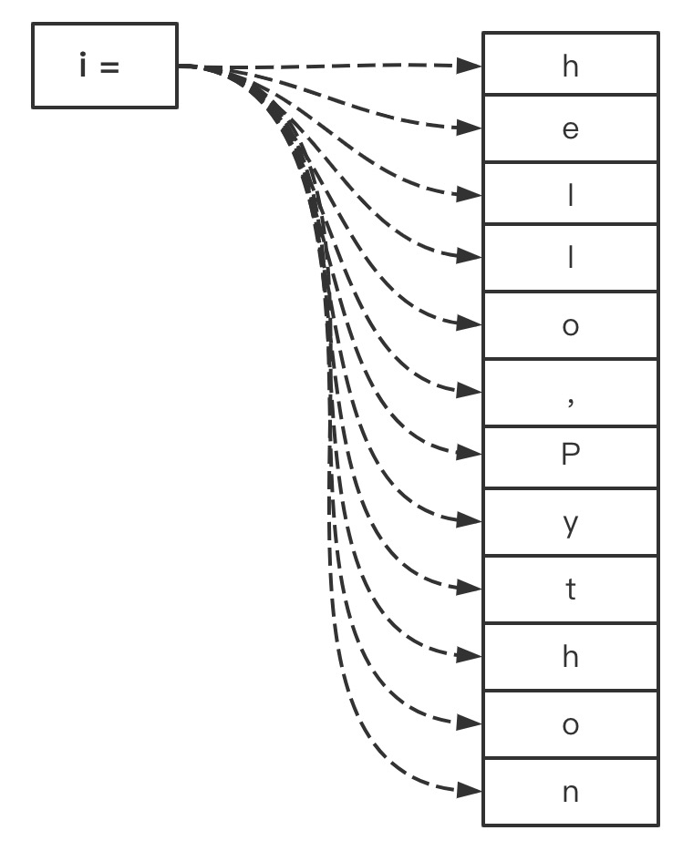

大多数情况下，Python代码是从上到下逐行解释执行，但是某些场景却不适用于这种顺序结构，比如在射击游戏中，通过输入`A`、`S`、`D`、`W`四颗方向键来控制精灵（游戏角色）的运动，再比如：求1到100的和，如果要实现上述的需求，那得就用**流程控制**来实现。在 Python 中有三种控制流语句—— `if`、`for`、 和 `while` 。

### if 语句

`if`语句是分支结构，对应的语境是`如果···就···`、`如果···否则···`，表示满足条件就执行。`if`语句的格式为：

```python
if 逻辑运算值:
    语句
    ...
elif 逻辑运算值:
    语句
    ...
else:
    语句
    ...
```

**语法说明**：

1. `if`、`elif`、`else`是分支语句的关键字，其中，`elif`和`else`可省略，`elif`可有多个；

2. 逻辑运算值是逻辑运算的结果，简单的可以认为是`True`或者`False`；

3. 缩进，`if`、`elif`、`else`后面**必须有冒号**（ `:` ），并且其子句必须有**相同的缩进**；

4. 分支语句按顺序执行，前面的语句满足时，后面的便不再执行；

**案例**：

1. 打招呼，根据当前时间，输出相应的招呼语句：
   
   ```python
   # 如果是早上，输出早上好 
   is_morning = True
   if is_morning:
     print('早上好')
   ```
   
   ```python
   # 判断当前时间，输出早上好或者下午好
   time_now = 'afternoon'
   if time_now == 'morning':
     print('早上好')
   elif time_now == 'afternoon':
     print('下午好')
   ```
   
   ```python
   # elif 多分支语句
   time_now = 'night'
   if time_now == 'morning':
     print('早上好')
   elif time_now == 'afternoon':
     print('下午好')
   elif time_now == 'night':
     print('晚上好')
   ```
   
   ```python
   # else语句，前面的判断不满足时执行
   time_now = 'unknow_time'
   if time_now == 'morning':
     print('早上好')
   elif time_now == 'afternoon':
     print('下午好')
   elif time_now == 'night':
     print('晚上好')
   else:
     print('你好')
   ```

2. 简单成绩管理系统，根据输入的成绩，输出`优秀`(`[90, 100]`)、`良好`(`[80,90)`)、`中等`(`[60,80)`)、`不及格`(`[0, 60)`) :
   
   ```python
   score = input('请输入分数：')
   # input输入的值都是字符串，作比较运算，需要将字符串转换为数值型
   score = int(score)
   if score >= 90:
     print('优秀')
   # Python可以使用连续使用运算符，也可以使用：score >= 80 and score < 90
   elif 80 <= score < 90:
     print('良好')
   elif 60 <= score < 80:
     print('中等')
   else:
     print('不及格')
   ```

3. 健康小助手，根据输入的身高体重计算BMI，并输出响应的健康状况，BMI的取值区间如下表所示：
   
   | 健康状况 | 国际BMI值(kg/m2) | 国内BMI值(kg/m2) |
   | ---- | ------------- | ------------- |
   | 偏瘦   | <18.5         | <18.5         |
   | 正常   | 18.5~25       | 18.5~24       |
   | 过重   | 25~30         | 24~28         |
   | 肥胖   | >=30          | >=28          |
   
   ```python
   height = float(input("输入身高（米）："))
   weight = float(input("输入体重（千克）："))
   # 计算 BMI 指数
   bmi = weight / (height * height)
   print('BMI指数为', bmi)
   if bmi < 18.5:
     print("偏瘦")
   elif 18.5 <= bmi < 24:
     print("正常")
   elif 24 <= bmi < 25:
     print("偏胖")
   else:
     print("超胖")
   ```

### for 语句

`for`、`while`语句是循环结构，所谓的循环结构就是将某段代码重复的执行一定的次数，在编程中使用得非常普遍。`for`循环一般用来执行特定的次数，而`while`循环用来执行不确定的次数，但是两则基本可以相互转换。

`for`循环要搭档关键字`in`一起使用，其语法给是为：

```python
for 变量 in sequence:
    子句
    ...
```

**语法说明**：

1. `for···in···`是固定的格式，注意冒号和**代码缩进**；

2. `sequence`简单的理解为序列，表示可以重复执行的对象（迭代对象），`sequence`会将每次循环的临时值赋值给`变量`；

看看下面的示例：

```python
for i in 'hello,Python':
    print(i)
```

上面的代码中，`hello,Python`是一个`序列`，`for`循环会根据`序列`的元素个数(`12个元素`)计算循环的次数，并将`hello,Python`的字符逐一赋值给变量`i`，执行的示意图如下所示：



`print()`函数默认执行完就换行，所以执行结果为：

```python
h
e
l
l
o
,
P
y
t
h
o
n
```

#### range()函数

上一节的示例遍历`hello,Python`这个序列，但是如果要重复执行一段代码，需要使用`range()`函数。`range()`函数用于**生成数字序列，用于重复执行一段代码**，如下示例：

```python
# 将 "hello, Python" 输出
for i in range(10):
    print('hello, Python')
```

运行结果：

```python
hello, Python
hello, Python
hello, Python
hello, Python
hello, Python
hello, Python
hello, Python
hello, Python
hello, Python
hello, Python
```

`range()`函数生成数字序列：

```python
# 生成数字序列
for i in range(10):
    print(i)
```

运行结果：

```python
0
1
2
3
4
5
6
7
8
9
```

`range()`函数当只有一个参数`n`时，生成`0···n-1` 的序列，**默认从0开始**。假设生成的序列是指定范围，如：`5~10`，则需要指定两个参数，分别表示序列的开始和结束：

```python
for i in range(5, 10):
    print(i)
```

运行结果：

```python
5
6
7
8
9
```

> `range()`函数生成的序列，包括序列的开始，不包括序列的结束。按照数学上的理解，`range(start, stop)`函数，`start`是开区间，`stop`是闭区间，表示为：`[start, stop)`。

以上的示例生成的序列是连续的，如果要生成规律性的间隔数字序列，可以指定步长（`step`），示例：

```python
for i in range(0, 10, 3):
    print(i)
```

运行结果：

```python
0
3
6
9
```

`range（)`函数的第三个参数用于指定序列的步长，表示元素值的递增幅度(`step`)，所以以上示例生成的序列为：`0,0+3,3+3,6+3`。`step`默认为`1`，不能为`0`，可以为负数：

```python
for i in range(10, 0, -3):
    print(i)
```

运行结果：

```python
10
7
4
1
```

#### else 子句

`for`语句可以和`else`子句配合使用。**`else`语句在`for`语句循环结束以后执行**。示例：

```python
for i in range(10, 0, -3):
    print(i)
else:
    print('运行完毕')
```

运行结果：

```python
7
4
1
运行完毕
```

**注意：**

`else`语句还可以和`break`语句结合使用，具体参见下文`break`章节。

### while 语句

`while`是Python中的另外一种循环结构，主要用于执行**不确定次数**的循环。`while`语句的格式为：

```python
while 逻辑运算值:
    子句
    ...
```

逻辑运算值是逻辑运算的结果，要么为`Ture`，要么为`False`。当逻辑运算值为`Ture`时，`while`结构执行，当逻辑运算值为`False`时，`while`结构终止。示例：

```python
i = 0
while i <= 5:
    print(i)
    i += 1
```

运行结果：

```python
1
2
3
4
5
```

**特别注意**，`while`结构一定要注意逻辑运算值，**避免陷入无限循环**。如上述示例中，去掉`i += 1`这一行，`i <= 5`衡成立，所以代码则一直运行。

### 流程控制子句嵌套

流程控制子句嵌套即条件语句或者循环语句可以相互嵌套，直接看示例：

```python
for i in range(1, 6):
    for j in range(1, 6):
        print(j, end=' ')
    print()
```

运行结果：

```python
1 2 3 4 5 
1 2 3 4 5 
1 2 3 4 5 
1 2 3 4 5 
1 2 3 4 5 
```

### break、continue、pass 子句

在某些场景中，需要"打乱"循环结构的执行流程。Python提供了`break`、`continue`、`pass`子句用于改变循环结构的执行流程。

**break**

`break`语句用于终止**最近的**`for` 或 `while`循环。示例：

```python
i = 0
while True:
    # 当 i >= 5 时终止循环
    if i >= 5:
        break
    print(i)
    i += 1
```

运行结果：

```python
0
1
2
3
4
```

`break`语句还可以结合`for...else`语句使用，当循环结构被`break`终止时，`else`语句便不会执行，换句话说，`break`和`else`语句是互斥关系。示例：

```python
for n in range(2, 10):
    for x in range(2, n):
        if n % x == 0:
            break
    else:
        print(n, '是素数')
```

当`break`执行时，`else`语句便不会执行，执行结果：

```python
2 是素数
3 是素数
5 是素数
7 是素数
```

**continue**

`continue`语句表示结束当前循环，继续执行下一次循环。示例：

```python
for num in range(2, 10):
    if num % 2 == 0:
        print("偶数", num)
        continue
    print("奇数", num)
```

运行结果：

```python
偶数 2
奇数 3
偶数 4
奇数 5
偶数 6
奇数 7
偶数 8
奇数 9
```

**pass**

`pass`语句不执行任何操作，可用于保证语法的完整性，还可以用作函数或条件子句的占位符。例如：

```python
while True:
    pass
```
